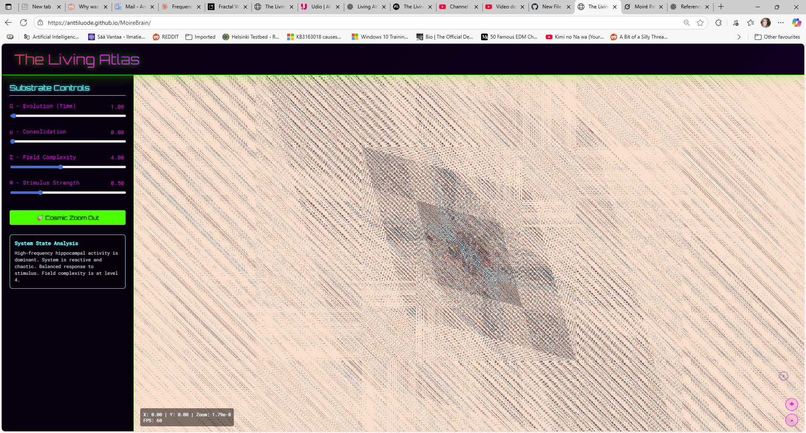

# Moiré Brain: An Interactive Model of Emergent Cognition

This project is not a traditional fractal viewer; it is an interactive, real-time simulation of a 
computational substrate inspired by the hierarchical memory systems of the brain. It visualizes how complex,
ordered, and organic patterns can emerge from the interference of simple, layered noise functions.

The user acts as an observer, manipulating the fundamental parameters of this "living" system—such as time,
memory consolidation, and complexity—to explore the resulting universe of emergent structures.

# Live Demo

https://anttiluode.github.io/MoireBrain/

# Key Features

GPU-Accelerated Rendering: Utilizes WebGL and GLSL shaders for a fully interactive, real-time experience.
Two-Layer Memory System: The core architecture is based on two interacting noise systems:
A Fast Layer ("Hippocampus"): High-frequency, detailed, and chaotic. Represents short-term, volatile memory.
A Slow Layer ("Cortex"): Low-frequency, large-scale, and stable. Represents long-term, consolidated memory.

# Emergent Moiré Patterns: 

The astonishing complexity—from diagonal lines to cellular structures and giant crystals—is not explicitly
programmed. It emerges from the Computational Moiré effect between the screen's pixel grid and the underlying 
grids of the noise functions at different zoom levels.

Interactive Controls: Users can directly manipulate the simulation's core parameters, including the rate of time,
the complexity of the field, and the degree of memory consolidation between the two layers.

# Controls

Pan: Click and drag the main view to navigate the landscape.

Zoom: Use the mouse wheel or the + / - buttons in the bottom-right corner.

Substrate Controls (Left Panel):

Ω - Evolution (Time): Controls the rate at which the noise fields evolve. Higher values create a more dynamic, shimmering effect.
μ - Consolidation: This is the most important slider. At 0.0, you are viewing only the chaotic Fast Layer. At 1.0, you see the stable Slow Layer. 
In between, you witness the two layers interfering, modeling the process of memory consolidation.
Σ - Field Complexity: Controls how many layers (octaves) of noise are stacked to create the texture. Higher values result in more fine-grained detail.
Ψ - Stimulus Strength: The mouse cursor acts as a constant stimulus. This slider controls how strongly it excites and distorts the field around it.
Cosmic Zoom Out: Press this button to begin a continuous, slow zoom-out to witness the emergence of large-scale patterns. Press it again to stop.

# The Core Concepts

The Engine: Layered Procedural Noise
The universe of the Atlas is built from Simplex Noise, a type of procedural gradient noise.
The "Atom" of the Universe: Unlike true randomness, Simplex Noise is deterministic and based on a hidden geometric grid of triangles. When you
zoom out to the absolute limit, the large "crystal" or "diamond" shape you see is the visual representation of a single grid cell from this base function.
It is the fundamental building block from which all the chaos is born.
Creating Texture (fbm): The rich, cloudy texture is created by stacking multiple layers (octaves) of this noise at different frequencies, a 
technique known as Fractional Brownian Motion (fbm). The Σ slider controls how many layers are stacked.

# The Architecture: A Two-Layer Brain

The simulation's key innovation is its use of two complete, independent fbm systems that model memory:
The Fast Layer ("Hippocampus"): Uses high-frequency, fast-evolving noise. It's like the brain's short-term memory—able to capture fine details
but inherently unstable and chaotic.
The Slow Layer ("Cortex"): Uses low-frequency, slowly-evolving noise. It's like long-term memory—it misses fine details but provides a stable,
large-scale structure to the system.
Consolidation: The μ slider is the bridge. It mixes the output of these two layers. This is analogous to the neuroscientific process of
memory consolidation, where the hippocampus "trains" the cortex over time, transferring important experiences into stable, long-term storage.

# The Discovery Mechanism: Computational Moiré

The stunning geometric patterns that appear at different zoom levels are a result of Computational Moiré. As you zoom, the fixed grid of 
your screen's pixels samples the hidden grids of the noise functions at different scales. When the grids align, a new, large-scale pattern 
spontaneously emerges from their interference.
You are not just zooming through a static image; you are actively participating in the creation of these emergent structures by changing you
r scale of observation.

# Speculative Link to Cognition

This model offers a powerful, computationally grounded metaphor for how high-level thought might emerge from neural dynamics.

# The Moiré Hypothesis of Thought:

If we consider different neural assemblies and memory systems in the brain as underlying "grids" of activity, then a "thought" could be 
the emergent Moiré pattern that arises from their interaction.

Thinking as Interference: The process of thinking could be the brain actively creating interference patterns between the fast, reactive, 
sensory-driven patterns of the "hippocampal" system and the slow, stable, abstract patterns of the "cortical" system.

An "Idea" as a Stable Pattern: A new idea or a memory might be a specific, stable Moiré pattern that forms when these layers
interact in a certain way. The feeling of "understanding" or an "aha!" moment could be the subjective experience of a chaotic
interference pattern suddenly resolving into a coherent, stable Moiré.

This model suggests that cognition is not a "thing" but a relational process. It doesn't exist in any single component, but
in the emergent, scale-dependent patterns created by the interference of multiple systems.

# How to Run Locally

Download the index.html file.
Open it in a modern web browser (Chrome, Firefox, Edge) that supports WebGL.
The entire simulation is self-contained in the HTML file.

# License: MIT
